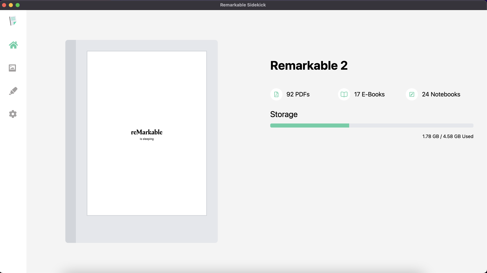

# Remarkable Sidekick

<p align="center">
    
</p>

# Electron App

## Development

```
cross-env NODE_ENV=development webpack --watch --progress --color
electron ./build/main.bundle.js
```

## Build

```
cross-env NODE_ENV=production webpack && electron-builder
```

## Connecting to Device

When you open remarkable-sidekick for the first time, you'll see the home page.

Before you click the green "Connect" Button, you'll need to first add your IP and password into the Settings tab.

1. Plug your device into your computer via USB
2. In the device, go to Left Side Menu -> Settings -> Help -> Copyrights and licenses -> General Information -> Scroll to Bottom
3. Find the Private IP, usually starting with a `10.xx.xx.x`
4. Find the username, `root` and the password which is in quotes
5. Carefully type these values into the Settings Tab in remarkable-sidekick

**See below:**


